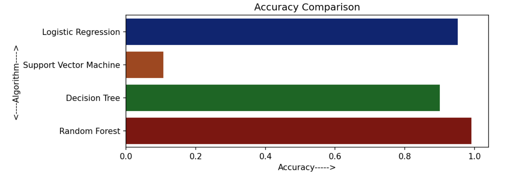

# Crop-Yield-Prediction 

## Table of Contents

- [Overview](#overview)
  - [About](#about)
  - [Screenshot](#screenshot)
  - [Links](#links)
- [My process](#my-process)
  - [Algorithms Used](#algorithms-used)
  - [Built with](#built-with)
  - [What I learned](#what-i-learned)
  - [Continued development](#continued-development)
  - [Useful resources](#useful-resources)
- [Authors](#authors)

## Overview

### About
Agricultural developments are the commonly ignored topic, yet so important for expansion of global economy
This project would suggest farmers for crop rotations absolutely based on data analysed on real time basis (that is the mineral content in the soil), unlike the traditional ways of cultivating only a few fixed type of crops on a fixed plot at a fixed time of the year, this would benefit the farmer, increment and add to his/her produce

The main goal is to make availability of information related to crop cultivation a tad bit easier for the farmers by providing them with required information collected on real time-based predictions 

This model needs to be feeded with Nitrogen-Phosphorous-Potassium(N-P-K) content of the soil and some other important inputs such as time to sow or harvest the crop, optimal or general temperature suitable for its proper growth, most suitable crop to be grown on a given type of soil, soil ph range, rainfall or amount of water required, fertilizers requires and so on.
The climatic conditions based on the geographic conditions have also been taken into consideration in framing the whole process.

### Screenshot

## My Process

### Algorithms Used
The implementation is done using Machine Learning trained algorithms which would collect the required dataset from an excel sheet (framed after extensive survey over specific crops) using the Pandas library in Python. 

To get the best-suited algorithm for the model, five different supervised machine learning algorithms are performed. The Algorithms are:
1. Multiple Linear Regression.
2. Logistic Regression.
3. Support Vector Machine.
4. Decision Tree.
5. Random Forest classification.

Multiple Linear Regression is the only regression algorithm and the other algorithms are classification algorithms.

### Built with

Libraries used to built the model:

1. pandas.
2. numpy.
3. matplotlib.
4. seaborn.
5. sklearn.

### What I learned

Through this project I got a better understanding how deploy a machine learning(ML) model on a real time data set. How to do predictive analysis properly and also got familiar with different libraries such as matplotlib, sklearn, numpy etc.

### Continued development

The main motto is to make the work of the farmers easier by using technologies as everything is being digitally controlled nowadays. Hence, we are also looking forward to make an GUI based application which will take inputs from agricultural dataset and will apply respective algorithm to predict the crop yield and will give some suitable suggestions to the farmers. This could be done in regional languages so that it will be more helpful for the farmers

### Useful resources

- [python](https://docs.python.org/3/)
- [pandas](https://pandas.pydata.org/docs/)
- [numpy](https://numpy.org/doc/)
- [matplotlib](https://matplotlib.org/stable/)
- [seaborn](https://seaborn.pydata.org/)
- [sklearn](https://scikit-learn.org/stable/)

## Authors

### Sayan Poddar: 
- [Linkedin](https://www.linkedin.com/in/sayan-poddar-71777222a/)
- [Github](https://github.com/DecodewithHappy)

### Sayan Debroy:
- [Linkedin](https://www.linkedin.com/in/sayan-deb-roy-20a124203/)
- [Github]()

### Shukrity Chakraborty
- [Linkedin](https://www.linkedin.com/in/shukrity-chakraborty-5a6507217/)
- [Github]()

### Vibha Yadav
- [Linkedin]()
- [Github]()
